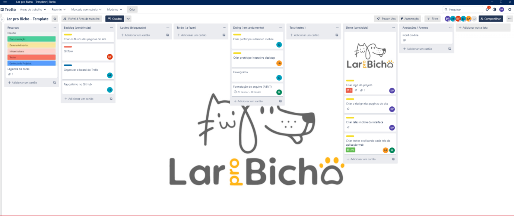
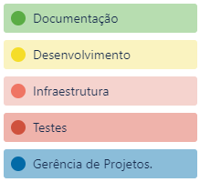

# Metodologia

A metodologia utilizada para realização deste trabalho baseia-se nas ferramentas usadas para a manutenção de códigos e demais artefatos quanto para a organização e execução das tarefas por parte da equipe, tornando o trabalho organizado e colocando em prática ferramentas e conhecimentos aprendidos nos microfundamentos.

## Relação de Ambientes de Trabalho

Os artefatos do projeto são desenvolvidos a partir de diversas plataformas disponíveis online e a relação dos ambientes com seu respectivo propósito. Essa relação é apresentada na tabela que se segue:

|     Ambiente      | Plataforma |                                              Link de Acesso                                              |
| :---------------: | :--------: | :------------------------------------------------------------------------------------------------------: |
|   Gerenciamento   |   Trello   | https://trello.com/invite/b/lDxh8WTb/ATTI35de9656de6ad6a3e7e5886c567cb3be4C76BD08/lar-pro-bicho-template |
|      GitHub       |   GitHub   |           https://github.com/ICEI-PUC-Minas-PMV-SInt/pmv-sint-2023-2-e2-proj-front-t1-group3>            |
| Protótipo Desktop | Marvel App |                                 https://marvelapp.com/prototype/f0d97bg                                  |

## Gerenciamento do Projeto

A equipe utilizou metodologias ágeis para realizar o projeto, tendo escolhido o modelo Scrum como base para definição do processo de desenvolvimento do mesmo.

A equipe está organizada da seguinte maneira:

-  **Scrum Master**: Alicia Ribeiro Andrade;
-  **Product Owner**: Sabrina Landi;
-  **Equipe de Desenvolvimento**:
   -  Beatriz dos Santos Ferreira;
   -  Theodoro Augusto de Brito.
-  **Equipe de Design**:
   -  Danilo Henrique Pupin;
   -  Lorena Terenzi.

Para organização e distribuição das tarefas do projeto, a equipe está utilizando o Trello estruturado com as seguintes listas:

-  **Recursos**: Este item contém o template das tarefas, com as configurações que todos devem seguir. Seu objetivo é facilitar a criação de novos cartões e o desenvolvimento das tarefas;
-  **Backlog**: Representa as tarefas a serem trabalhadas pelos integrantes, todas as atividades ao decorrer do projeto foram incorporadas a essa lista;
-  **Locked**: Contém o que impede o desenvolvimento de alguma tarefa, de modo que os outros integrantes vejam o que travou aquela tarefa e possa ajudar a resolver;
-  **To Do**: Este item representa o Sprint Backlog da aplicação, contém a situação atual do que o grupo está desenvolvendo;
-  **Doing**: Representa a fase após as tarefas serem decididas no “To Do”, no momento em que cada integrante iniciar a tarefa ela deve ser colocada neste item;
-  **Test**: Este é o item que se refere a Checagem de Qualidade dos itens desenvolvidos pelo grupo. Ao final de cada semana o grupo revisa o que foi concluído para ver a necessidade de mudanças ou não, caso seja necessário ela retorna ao item “Doing”;
-  **Done**: Este item representa as tarefas que já passaram pela checagem de qualidade e não houve necessidades de mudanças, ou seja, ela se torna uma tarefa terminada.
-  **Anotações/Anexos**: Este item foi criado para ser utilizado pelo grupo de modo que possam compartilhar links ou anotações referentes ao projeto.

O quadro kanban do grupo no Trello está disponível através da URL https://trello.com/invite/b/lDxh8WTb/ATTI35de9656de6ad6a3e7e5886c567cb3be4C76BD08/lar-pro-bicho-template e é apresentado, no estado atual, na Figura 01. A definição desta estrutura se baseou na proposta feita por Littlefield (2016).

Figura 01 - Tela do Trello utilizada pelo grupo

A tarefas são, ainda, etiquetadas em função da natureza da atividade e seguem o seguinte esquema de cores/categorias:

-  Gerencia de Projetos;
-  Documentação;
-  Desenvolvimetno;
-  Infraestrutura;
-  Testes;

   
